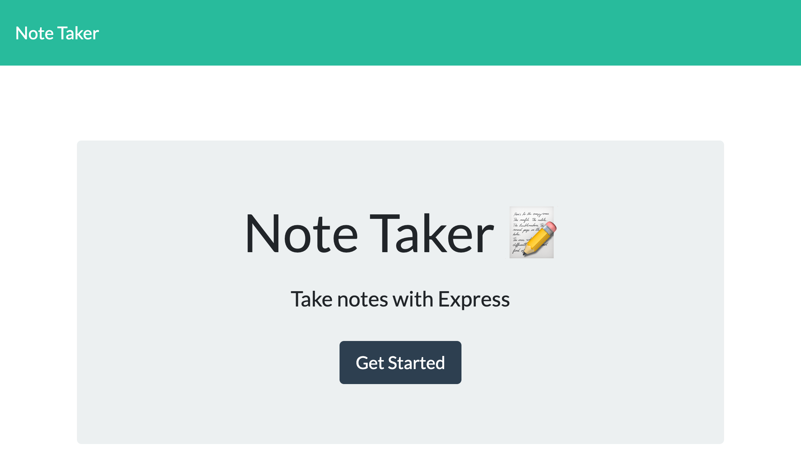
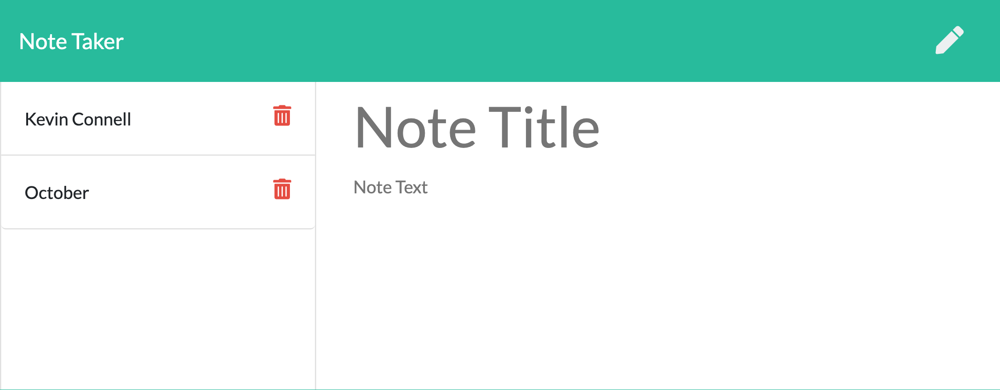

# Note Taker
  [](https://opensource.org/licenses/MIT)

  Deployed: https://shielded-shore-00169.herokuapp.com/

  ## Description

  This application allows the user to save and delete personal notes to help with their busy lives.

  ## Table of Contents

  * [Installation](#installation)

  * [Usage](#usage) 
  
  * [License](#license)

  * [Contributing](#contributing)

  * [Tests](#tests)

  * [Questions](#questions)
  
  ## Installation

  To run, install using the following command:
  ```
  npm i
  ```

  ## Usage

  For use: Feel free to navigate the app using the link provided. Use the Get Started button to go to the notes section.

  
  
  
  ## License

  This application is protected under a MIT license

  ## Contributing

  Email me with an requests to contribute!

  ## Tests

  To run tests, run the following command:
  ```
  npm test
  ```

  ## Questions?

  If you have any questions or issues please contact me via email at kevin.t.connell@gmail.com. You can find more examples of my work at [kevinconnell96](https://github.com/kevinconnell96)
